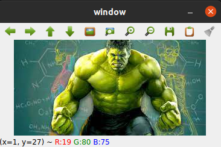
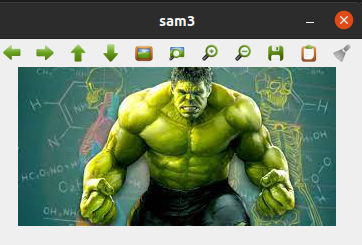
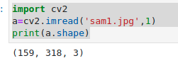

# READ AND WRITE AN IMAGE
## AIM
To write a python program using OpenCV to do the following image manipulations.
i) Read, display, and write an image.
ii) Access the rows and columns in an image.
iii) Cut and paste a small portion of the image.

## Software Required:
Anaconda - Python 3.7
## Algorithm:
### Step1:
Choose an image and save it as a filename.jpg
### Step2:
Use imread(filename, flags) to read the file.
### Step3:
Use imshow(window_name, image) to display the image.
### Step4:
Use imwrite(filename, image) to write the image.
### Step5:
End the program and close the output image windows.
## Program:
### Developed By:
### Register Number: 
i) #To Read,display the image
```
 import cv2
a=cv2.imread("sam1.jpg",1)
cv2.imshow('window',a)
cv2.waitKey(0)
cv2.destroyAllWindows()
```
ii) #To write the image
```
import cv2
a=cv2.imread('sam1.jpg',1)
cv2.imwrite('sam2.jpg',a)
cv2.imshow('sam3',a)
cv2.waitKey(0)
cv2.destroyAllWindows()


```
iii) #Find the shape of the Image
```
import cv2
a=cv2.imread('sam1.jpg',1)
print(a.shape)


```
iv) #To access rows and columns
```
import cv2
a=cv2.imread('r.jpg',1)
import random
for i in range (100):
    for j in range(a.shape[1]):
        a[i][j] = [random.randint(0,255),random.randint(0,255),random.randint(0,255)]
cv2.imshow('Iron man',a)
cv2.waitKey(0)
cv2.destroyAllWindows()


```
v) #To cut and paste portion of image
```
import cv2
a=cv2.imread('r.jpg',1)
tag = a[100:200,100:200]
a[50:150,50:150] = tag
cv2.imshow('Image',a)
cv2.waitKey(0)
cv2.destroyAllWindows()


```

## Output:

### i) Read and display the image


### ii)Write the image


### iii)Shape of the Image



### iv)Access rows and columns
<br>
<br>

### v)Cut and paste portion of image
<br>
<br>

## Result:
Thus the images are read, displayed, and written successfully using the python program.


